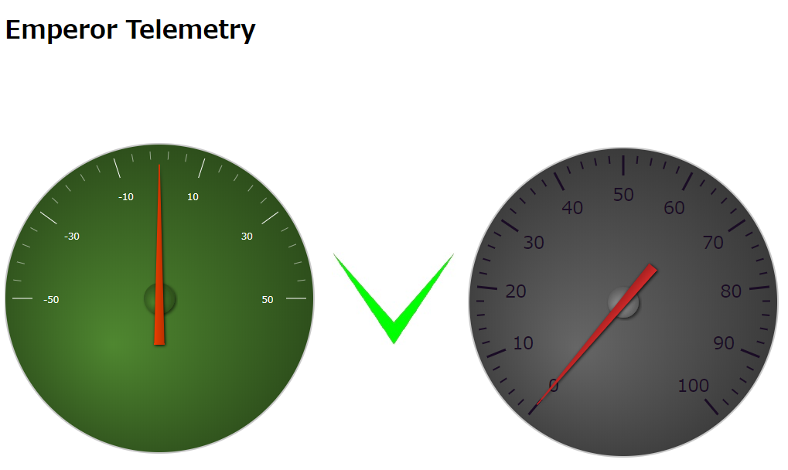
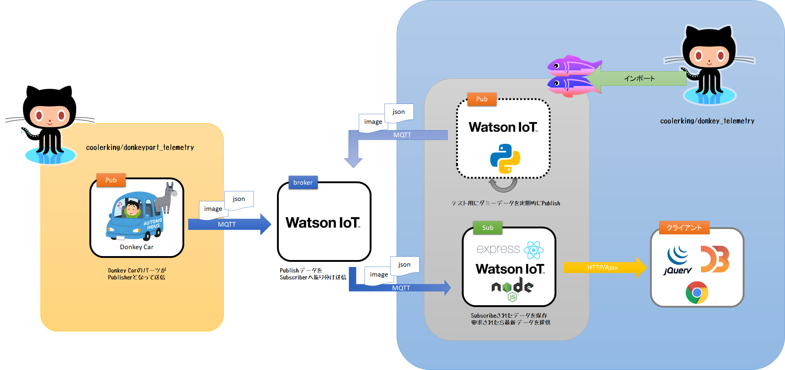

# Donkeypart Telemetry


Donkey Car上の`manage.py`を編集して、Vehicleフレームワーク上にパーツとして登録することのできる、Publisher/Subscriberを提供する。



[Donkey Telemetry](https://github.com/coolerking/donkey_telemetry) と連携することで、Web上でテレメトリ情報を参照することができる。

## 対応するMQTTブローカ

* Eclipse Mosquitto
   OSSのMQTTブローカ。[`tests/conf/mosq/docker-compose.yml`](./tests/conf/mosq/docker-compose.yml) を提供しているので、Docker Desktopや[play with Docker](https://labs.play-with-docker.com/) などでコンテナ起動することができる。


* IBM Watson IoT Platform
   IBM社が提供するクラウドサービス [IBM Cloud](https://cloud.ibm.com/registration) 内の１サービスとして提供されているMQTTブローカ]。執筆時点では、Freeプランを提供しており、無償でテストすることができる。

> Mosquittoを使用する場合は`donkeypart_telemetry.mosq`を、IBM Watson IoT Platform を使用する場合は`donkeypart_telemetry.iotf`をインポートする。

> IBM Watson IoT Platform のQuickstart環境では動作しない（Quickstartでは、イメージ送受信をサポートしていない）。

## インストール手順

1. Donkey Car上のRaspberry Piへログイン
2. `cd ~/`
3. `git clone https://github.com/coolerking/donkeypart_telemetry.git`
4. `cd donkeypart_telemetry`
5. IBM IoT Platform を使用する場合、`pip install ibmiotf`を実行
6. Eclipse Mosquitto を使用する場合、`pip install paho-mqtt`を実行
7. `pip install -e .`
8. `cd ~/mycar`
9. IBM IoT Platform を使用する場合
 1. IBM Cloud 上にIBM Watson IoT Platform インスタンスを構築し、コンソールを開いて、組織IDを確認する
 2. コンソール上でデバイスを登録し、デバイスタイプ、デバイスID、APIキー、秘密トークンを取得する
 3. コンソール上で、アプリケーションを登録し、秘密トークンを取得する
 4. `vi telemetry.ini`を実行し、編集する
    ```ini
    [device]
    org={組織ID}
    type={デバイスタイプ}
    id={デバイスID}
    auth-method=token
    auth-token={デバイス側秘密トークン}
    clean-session=true

    [application]
    org={組織ID}
    id={アプリケーションを一意に泡ラス文字列を適当につける}
    auth-method=apikey
    auth-key={APIキー}
    auth-token={アプリケーション側秘密キー}
    clean-session=true
    ```
9. `vi manage.py` を実行し、以下のようにVehicleフレームワークへ追加
   ```python
        :
        # Eclipse Mosquitto を使用する場合
        from donkeypart_telemetry.iotf import PubTelemetry, SubTelemetry
        # IBM Watson IoT Platform を使用する場合 
        from donkeypart_telemetry.iotf import PubTelemetry, SubTelemetry

        :
        # drive関数内の適当な位置に以下のコードを追加

        # Publish/Subscribe対象データ
        tubitems = [
            'cam/image_array',
            'user/mode',
            'user/angle',
            'user/throttle',
            'pilot/angle',
            'pilot/throttle',
            'angle',
            'throttle'
        # MQTTブローカ上にPublishされたデータを取り込む場合
        self.vehicle.add(SubTelemetry(app_conf_path='telemetry.ini', dev_conf_path='telemetry.ini'), outputs=tubitems)

        # データをMQTTブローカへ送信したい場合
        self.vehicle.add(PubTelemetry(dev_conf_path='telemetry.ini', pub_count=20), inputs=tubitems)
        :
   ```
10. `python manage.py drive` を実行し、自動・手動運転を開始する

> `telemetry.ini`において、PubTelemetryのみ使用する場合はdeviceセクションのみでよいが、SubTelemetryのみを使用する場合はapplicationセクションだけでもよい（ただし、すべてのデバイスタイプおよびデバイスIDをSubscribe対象となる）。

## Donkey Telemetryへの連携

以下の図は、IBM Watson IoT PlatformおよびGlitchの利用を前提としたシステム構成図である。



本リポジトリは上図右側の黄色部分のソースコードを提供している。

## 参考

- [本家donkeycarリポジトリ](https://github.com/autorope/donkeycar)
- [DonkeyCarドキュメントの日本語訳](https://github.com/coolerking/donkeycar_jpdocs)
- [Tubデータを再生するパーツクラス](https://github.com/coolerking/donkeypart_tub_loader)
- `tubclean`コマンドにより穴あきになった [Tubデータの連番を再整列するツール](https://github.com/coolerking/tubarrange)
- [Donkey Car用Logicool F710/Elecom JC-U3913Tジョイスティックコントローラ](https://github.com/coolerking/donkeypart_game_controller)

- [Donkey Telemetry](https://github.com/coolerking/donkey_telemetry)