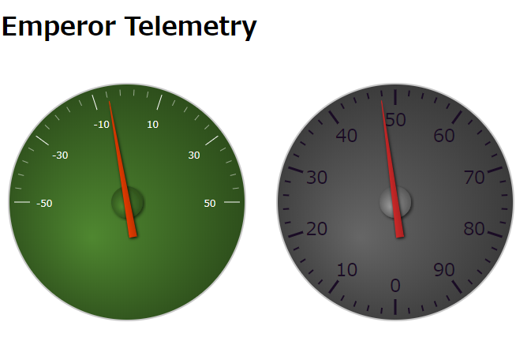
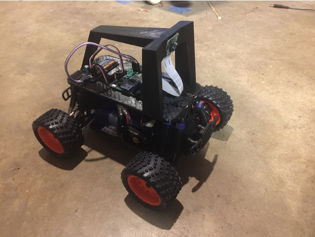

# Donkey Telemetry

Donkey Carにpartとして搭載可能なMQTT Publisher、MQTT　Subscriberのサンプルを提供する。

## Donkey Car

[Donkey Car](http://www.donkeycar.com/)とは、Raspberry Piを市販のRCカーに搭載して、安価に自動運転を実現するプラットフォームである。

自動運転のための[プログラム](https://github.com/autorope/donkeycar)や一部の改造用パーツの[設計図](https://www.thingiverse.com/thing:2260575)がオープンソース化されている。またコミュニティが運営しているネット店舗（[Donkey Store/US](https://squareup.com/store/donkeycar)/[Robocar Store/香港](https://www.robocarstore.com/)）よりフルキットで購入することも可能である。

組み立て方は[ドキュメント](https://github.com/coolerking/donkeycar_jpdocs)やこちらの[スライド](https://www.slideshare.net/HoriTasuku/donkey-car)を参考にすれば、RCカーやRaspberry Piの結線に関する経験の少ない人でも制作することができる。

## Donkey Car 側パーツ

Dpnkey Car の[ソフトウェア](https://github.com/autorope/donkeycar)は、「[パーツ](https://github.com/coolerking/donkeycar_jpdocs/blob/master/donkeycar/docs/parts/about.md)」というクラスを追加(`Vehicle#add()`)できるようなアーキテクチャを採用している。

本リポジトリでは、MQTTクライアント実装サンプルとして、以下の２つのパーツを提供している。

- テレメトリー用Publisherパーツ `PubTelemetry`
   リアルタイムのスロットル値、アングル値の監視ができるように、MQTTブローカへ送信するパーツをPublisherのサンプルとして作成した。
   IBM Watson IoT Platform用 PubTelemetryは [./iotf/part.py](./iotf/part.py)に、eclipse-mosquitte用 PubTelemetryは [./mosq/part.py](./mosq/part.py) に実装が存在する。

- 外部のオートパイロットサーバから操作情報を取得するパーツ `SubPilot`
   PubTelemetryとは逆に、スロットル値、アングル値を外部のサーバから受け取るためのパーツをサンプルとして作成した。ただし、判断要素となるイメージファイルデータを送信していないため、本格的に外部ノード上で推論処理を実行させるには、機能が不足している。あくまで参考の実装の位置づけである。
   IBM Watson IoT Platform用 SubPilotは [./iotf/part.py](./iotf/part.py)に、eclipse-mosquitte用 SubPilotは [./mosq/part.py](./mosq/part.py) に実装が存在する。

詳細は、[./iotf/README.md](./iotf/README.md)/[./mosq/README.md](./mosq/README.md)を参照のこと。

## テレメトリWebアプリ

- [node ディレクトリ](./node)
   Donkey Telemetry v2 のソースコードを格納している。Node.js上で動作する前提となっているが、サーバサイドプログラムがMTQQブローカと直接通信可能なネットワーク環境も前提となる。

詳細は、[./node/README.md](./node/README.md)を参照のこと。

## ローカルPC上で実行可能なデモ環境

Donkey Telemetry はインターネット上でのみ動作確認できるプログラムであったため、[./demo](./demo) ディレクトリにPROXY管理下のPC上でも実行可能なデモプログラムを用意した。

本ディレクトリのコンテンツを使うことでDocker Desktop上で必要なコンテナをすべて起動し、動作を確認できる。
Docker Composeファイル `docker-compose.yml` を使って、以下の3つのコンテナを起動する。
- broker
   MQTTブローカ eclipse-mosquitto
- pub
   publisherダミー。本来はDonkey Car上で動作させ無くてはならないが、デモ環境なのでダミーのPythonプログラムで代用している。
- sub
   subscriberとなる Node.js アプリ。D3.jsのサンプルコードを流用してスロットルゲージを表示する。

詳細は [./demo/docs/README.md](./demo/docs/README.md) を参照のこと。

# ユーティリティ

## [MQTT疎通確認プログラム](./test)

MQTTブローカとの疎通を確認するためのプログラム。[Mosquitto用](./test/mosq) と [IBM Watson IoT Platform用](./test/iotf)がある。

詳細は、[./test/iotf/README.md](./test/iotf/README.md)/[./test/mosq/README.md](./test/mosq/README.md)を参照のこと。

# ライセンス

本リポジトリ上のコンテンツはすべて[MITライセンス](./LICENSE)準拠とする。

