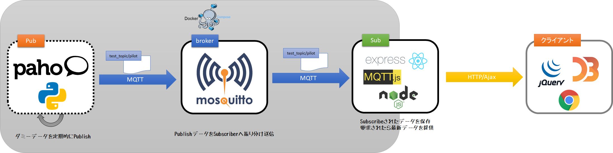

# Donkey Telemetry サンプル実行環境

本ディレクトリは、Donkey Carを持っていない人が、試しにDonkey Telemetryを動かしてみたい方に、下図のような環境で実行可能な`docker-compose.yml`を提供する。

## インストール

1. Docker Desktopをインストール
2. (プロクシ環境で実行する場合)`sub/Dockerfile`および`pub/Dockerfile`を編集し、プロクシ設定を有効にする
3. Windows Power Shell を管理者権限で起動
4. `docker`ディレクトリへ移動
5. `docker-compose build` を実行

## 起動

1. Windows Power Shell を管理者権限で起動
2. `docker`ディレクトリへ移動
3. `docker-compose up -d` を実行

## 動作中のログ参照

1. Windows Power Shell を管理者権限で起動
2. `docker`ディレクトリへ移動
3. `docker-compose logs -f` を実行

停止させるにはCtrl+Cを押す。

## 動作確認

1. Chromeブラウザを起動
2. `http://127.0.0.1:3000` を開く

## 停止

1. Windows Power Shell を管理者権限で起動
2. `docker`ディレクトリへ移動
3. `docker-compose stop` を実行
4. `docker-compose rm -f` を実行

